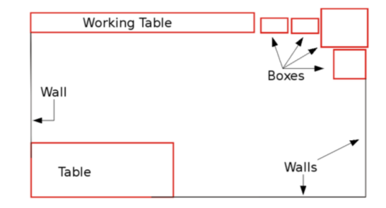
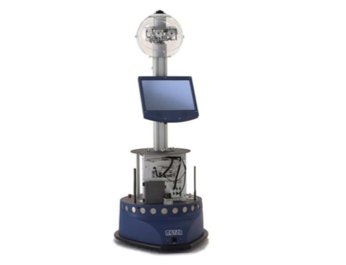
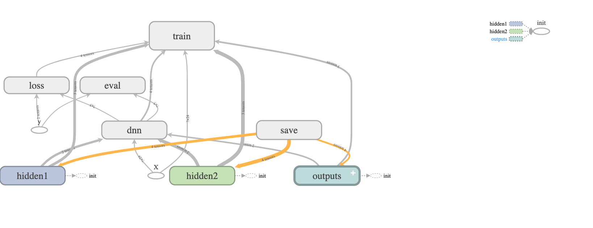
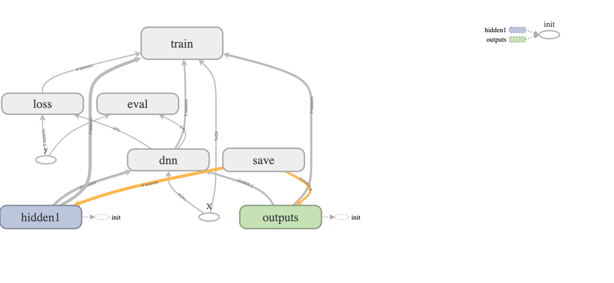
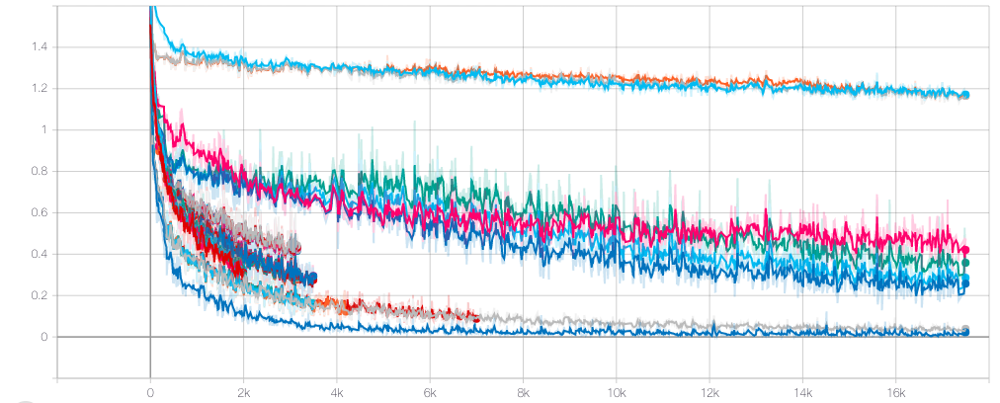

# Using an Artificial Neural Network to mimic a Robot&rsquo;s Internal Navigational System  
#### Introduction
For this project we chose to use data gathered from an autonomous mobile robot as it navigated around a closed room&mdash;as illustrated by figure 1[1]. The data was collected by a team of research scientists that tried to mimic a robot&rsquo;s internal navigational system[1]. They did this by collecting various sensor readings from the robot as it navigated around the room and then applied various machine learning algorithms to the data. Figure 2 shows the robot used in the experiment. This robot had a total of 24 ultrasound sensors around its &lsquo;waist&rsquo; and they were used to read how far away the robot was from the wall[1]. Furthermore, the robot had a laser sensor, a collision sensor, and a robotic head with an omnidirectional head[1].The robot could only move in one of four ways: forward, slight right-turn, sharp right-turn, and slight left-turn. Using the data collected from these sensors, our group will attempt to create a machine learning program that mimics the robot&rsquo;s internal navigational system best.This example is the perfect example for using machine learning models because after inspecting the data, it was really difficult to find patterns from the sensors to predict what movement the robot would make.Figure 1: The room in which the robot&rsquo;s navigational algorithm was tested.
Figure 2:The SCITOS G5 mobile robot. The robot is programed with a navigational algorithm that uses a wall following technique to avoid collisions.
#### Neural Network
Two neural networks were constructed for this project. Each neural network had similar parameters and characteristics, except the number of hidden layers. Figure 5 shows a neural network with two hidden layers, while figure 6 shows a neural network with one hidden layer. Since most functions can be represented by one or two hidden layers, no more hidden layers were added to the network. Nevertheless, in both network configurations the following steps were taken to construct them. Placeholder nodes titled X and y were initially created to store the training data and class labels. After doing so, the construction of the hidden layer(s) was undertaken. For both neural networks, the node titled dnn contained the various connections between each layer. Using Tensorflow's dense function, a fully connected network was constructed in the following stepwise fashion: the input layer was connected to hidden-layer one, then hidden-layer one was connected to hidden-layer two, and lastly, hidden-layer two was connected to the output layer. Tensorflow's dense function not only created and linked all the layers together, but it also, automatically set the initial weights and bias in the network (ie., the kernel matrix was initialized by Tensorflow).After connecting the neural network, the next step was to decide on the type of cost function to use to actually train the model. Since Softmax Regression would be used to predict the label with the highest estimated probability, cross-entropy was chosen as the cost function. The output from the logits was used to compute the mean cross-entropy. This is shown by the node titled loss in figures 5 and 6. Once the network's layers and cost function were constructed, the next step was creating a node that implemented gradient descent. This is shown by the node titled train in figures 5 and 6. The last important step had to do with model evaluation. Overall accuracy was chosen to properly evaluate a model's performance over the training data. This measure determines if the actual target value corresponds to the highest logit. This is represented in figures 5 and 6 by the node eval. Figure 5: Artificial Neural Network with two hidden layers.
Figure 6: Artificial Neural Network with one hidden layer.
After splitting the original data using a 65-35 split ratio, the training set consisted of 3,500 training examples and the test set consisted of 1,956 examples. Mini-batch Gradient descent was used for each training step. Furthermore, the batch size used to train the network on each step was set to one hundred and the total number of batches executed during one training epoch was computed using the following formula:
The table in Appendix A shows the results of tuning the neural network. Initially, a network with two hidden layers was used with 300 neurons in the first layer and 150 neurons in the second layer. Furthermore, this initial model had a starting learning rate of 0.01, an epoch of ninety, and each hidden layer used ReLU activation functions. After running tensorflow on this initial model, an accuracy score of ninety-four percent was achieved. This meant that the highest scoring logit corresponded to the actual target label ninety-four percent of the time. Even though, this was a high accuracy score, our group wanted to see if this score could be increased by fine-tuning the initial model. As the table in Appendix A shows, initially the number of neurons in each layer was changed. For all intensive purposes this change did not really improve the overall accuracy score by much. Next, our group decided to use only one hidden-layer instead of two. Unfortunately, this change generally decreased the model's overall accuracy score. It was not until our group looked at the academic paper titled: Short-Term Memory Mechanisms in Neural Network Learning of Robot Navigation Tasks: A Case Study, were we able to significantly improve the model's accuracy score. 
In the paper, the authors used a similar neural network to ours, except their neural network used only one hidden layer and used a sigmoid activation function[1]. More importantly, the paper empirically determined that a starting learning rate of 0.05 and an epoch of 500 produced statistically significant results[1]. Thus, the learning rate was increased to 0.05 and the epoch was increased to 200[1].
After doing so, the best accuracy scores were achieved as illustrated by the highlighted results in Appendix A. Furthermore, figure 7 shows that a learning rate of 0.05 lead to a lower cross-entropy score than a learning rate of 0.01. In the end, the three highest scoring models were used for subsequent testing. 
Figure 7:Graph that plots cross-entropy versus the number of gradient descent steps for different hyperparameter values. The steeper slopes seen at the beginning of the graph correspond to models that had a higher learning rate.
The three best trained models from Appendix A were used on the test set. To evaluate each model's performance, our group decided to use a micro-averaged F1-score, since the target labels had an uneven distribution. Under micro-averaging, precision and recall scores are initially calculated for each target label. Then, all of the precision and recall scores for each label are averaged together to form two different micro averages. The first micro-average represents precision while the other micro-average represents recall. After doing so, the micro-average F1-score is computed by substituting these two micro-averages in the F1-equation for precision and recall. Table 1 shows the results of testing the three models. Interestingly, each model outputted a micro-averaged F1-score of 89%. The results show that all three models provided a good balance between precision and recall for classifying robotic movement. Furthermore, the results show that this multi-classification task can be accurately modeled with only one hidden layer. Consequently, a deep learning network is not needed for this classification task. 
<html><body><table class="c18"><tbody><tr class="c8"><td class="c4" colspan="1" rowspan="1">
# of neurons in hidden layer one
</td><td class="c4" colspan="1" rowspan="1">
# of neurons in hidden layer two
</td><td class="c4" colspan="1" rowspan="1">
# of hidden layers
</td><td class="c4" colspan="1" rowspan="1">
# of gradient descent steps
</td><td class="c4" colspan="1" rowspan="1">
Starting Learning Rate
</td><td class="c4" colspan="1" rowspan="1">
Activation function 
</td><td class="c4" colspan="1" rowspan="1">
Micro-Averaged F1 score 
</td></tr><tr class="c8"><td class="c4" colspan="1" rowspan="1">
200
</td><td class="c4" colspan="1" rowspan="1">
0
</td><td class="c4" colspan="1" rowspan="1">
1
</td><td class="c4" colspan="1" rowspan="1">
7000
</td><td class="c4" colspan="1" rowspan="1">
0.05
</td><td class="c4" colspan="1" rowspan="1">
ReLu
</td><td class="c4" colspan="1" rowspan="1">
89%
</td></tr><tr class="c8"><td class="c4" colspan="1" rowspan="1">
200
</td><td class="c4" colspan="1" rowspan="1">
100
</td><td class="c4" colspan="1" rowspan="1">
2
</td><td class="c4" colspan="1" rowspan="1">
7000
</td><td class="c4" colspan="1" rowspan="1">
0.05
</td><td class="c4" colspan="1" rowspan="1">
ReLu
</td><td class="c4" colspan="1" rowspan="1">
89%
</td></tr><tr class="c8"><td class="c4" colspan="1" rowspan="1">
200
</td><td class="c4" colspan="1" rowspan="1">
100
</td><td class="c4" colspan="1" rowspan="1">
2
</td><td class="c4" colspan="1" rowspan="1">
7000
</td><td class="c4" colspan="1" rowspan="1">
0.05
</td><td class="c4" colspan="1" rowspan="1">
Tanh
</td><td class="c4" colspan="1" rowspan="1">
89%
</td></tr></tbody></table>
Table 1

&nbsp; &nbsp; &nbsp; &nbsp; 

&nbsp;&nbsp;&nbsp;&nbsp;&nbsp;&nbsp;&nbsp;&nbsp;

</body></html>
  
# Citations
[1] Freire, Ananda L., et al. &ldquo;Short-Term Memory Mechanisms in Neural Network Learning of Robot Navigation Tasks: A Case Study.2009 6th Latin American Robotics Symposium (LARS 2009), 2009, doi:10.1109/lars.2009.5418323.

## Appendix A 
<html><body>

Fine-Tuning the ANN Model
<table class="c18"><tbody><tr class="c8"><td class="c4" colspan="1" rowspan="1">
# of neurons in hidden layer one
</td><td class="c4" colspan="1" rowspan="1">
# of neurons in hidden layer two
</td><td class="c4" colspan="1" rowspan="1">
# of hidden layers
</td><td class="c4" colspan="1" rowspan="1">
# of gradient descent steps
</td><td class="c4" colspan="1" rowspan="1">
Starting Learning Rate
</td><td class="c4" colspan="1" rowspan="1">
Activation function
</td><td class="c4" colspan="1" rowspan="1">
Overall Accuracy Score
</td></tr><tr class="c8"><td class="c0" colspan="1" rowspan="1">
300
</td><td class="c0" colspan="1" rowspan="1">
150
</td><td class="c0" colspan="1" rowspan="1">
2
</td><td class="c0" colspan="1" rowspan="1">
3495
</td><td class="c4" colspan="1" rowspan="1">
0.01
</td><td class="c4" colspan="1" rowspan="1">
ReLu
</td><td class="c4" colspan="1" rowspan="1">
94%
</td></tr><tr class="c8"><td class="c0" colspan="1" rowspan="1">
250
</td><td class="c0" colspan="1" rowspan="1">
150
</td><td class="c0" colspan="1" rowspan="1">
2
</td><td class="c0" colspan="1" rowspan="1">
3495
</td><td class="c4" colspan="1" rowspan="1">
0.01
</td><td class="c4" colspan="1" rowspan="1">
ReLu
</td><td class="c4" colspan="1" rowspan="1">
95%
</td></tr><tr class="c8"><td class="c0" colspan="1" rowspan="1">
200
</td><td class="c0" colspan="1" rowspan="1">
150
</td><td class="c0" colspan="1" rowspan="1">
2
</td><td class="c0" colspan="1" rowspan="1">
3495
</td><td class="c4" colspan="1" rowspan="1">
0.01
</td><td class="c4" colspan="1" rowspan="1">
ReLu
</td><td class="c4" colspan="1" rowspan="1">
92%
</td></tr><tr class="c8"><td class="c0" colspan="1" rowspan="1">
150
</td><td class="c0" colspan="1" rowspan="1">
150
</td><td class="c0" colspan="1" rowspan="1">
2
</td><td class="c0" colspan="1" rowspan="1">
3495
</td><td class="c4" colspan="1" rowspan="1">
0.01
</td><td class="c4" colspan="1" rowspan="1">
ReLu
</td><td class="c4" colspan="1" rowspan="1">
93%
</td></tr><tr class="c8"><td class="c0" colspan="1" rowspan="1">
150
</td><td class="c0" colspan="1" rowspan="1">
0
</td><td class="c0" colspan="1" rowspan="1">
1
</td><td class="c0" colspan="1" rowspan="1">
3495
</td><td class="c4" colspan="1" rowspan="1">
0.01
</td><td class="c4" colspan="1" rowspan="1">
ReLu
</td><td class="c4" colspan="1" rowspan="1">
88%
</td></tr><tr class="c8"><td class="c0" colspan="1" rowspan="1">
200
</td><td class="c0" colspan="1" rowspan="1">
0
</td><td class="c0" colspan="1" rowspan="1">
1
</td><td class="c0" colspan="1" rowspan="1">
3495
</td><td class="c4" colspan="1" rowspan="1">
0.01
</td><td class="c4" colspan="1" rowspan="1">
ReLu
</td><td class="c4" colspan="1" rowspan="1">
85%
</td></tr><tr class="c8"><td class="c0" colspan="1" rowspan="1">
250
</td><td class="c0" colspan="1" rowspan="1">
0
</td><td class="c0" colspan="1" rowspan="1">
1
</td><td class="c0" colspan="1" rowspan="1">
3495
</td><td class="c4" colspan="1" rowspan="1">
0.01
</td><td class="c4" colspan="1" rowspan="1">
ReLu
</td><td class="c4" colspan="1" rowspan="1">
90%
</td></tr><tr class="c8"><td class="c0" colspan="1" rowspan="1">
300
</td><td class="c0" colspan="1" rowspan="1">
0
</td><td class="c0" colspan="1" rowspan="1">
1
</td><td class="c0" colspan="1" rowspan="1">
3495
</td><td class="c4" colspan="1" rowspan="1">
0.01
</td><td class="c4" colspan="1" rowspan="1">
ReLu
</td><td class="c4" colspan="1" rowspan="1">
87%
</td></tr><tr class="c8"><td class="c0" colspan="1" rowspan="1">
350
</td><td class="c0" colspan="1" rowspan="1">
0
</td><td class="c0" colspan="1" rowspan="1">
1
</td><td class="c0" colspan="1" rowspan="1">
3495
</td><td class="c4" colspan="1" rowspan="1">
0.01
</td><td class="c4" colspan="1" rowspan="1">
ReLu
</td><td class="c4" colspan="1" rowspan="1">
88%
</td></tr><tr class="c8"><td class="c0" colspan="1" rowspan="1">
400
</td><td class="c0" colspan="1" rowspan="1">
0
</td><td class="c0" colspan="1" rowspan="1">
1
</td><td class="c0" colspan="1" rowspan="1">
3495
</td><td class="c4" colspan="1" rowspan="1">
0.01
</td><td class="c4" colspan="1" rowspan="1">
ReLu
</td><td class="c4" colspan="1" rowspan="1">
88%
</td></tr><tr class="c8"><td class="c0" colspan="1" rowspan="1">
500
</td><td class="c0" colspan="1" rowspan="1">
0
</td><td class="c0" colspan="1" rowspan="1">
1
</td><td class="c0" colspan="1" rowspan="1">
3495
</td><td class="c4" colspan="1" rowspan="1">
0.01
</td><td class="c4" colspan="1" rowspan="1">
ReLu
</td><td class="c4" colspan="1" rowspan="1">
84%
</td></tr><tr class="c8"><td class="c0" colspan="1" rowspan="1">
600
</td><td class="c0" colspan="1" rowspan="1">
0
</td><td class="c0" colspan="1" rowspan="1">
1
</td><td class="c0" colspan="1" rowspan="1">
3495
</td><td class="c4" colspan="1" rowspan="1">
0.01
</td><td class="c4" colspan="1" rowspan="1">
ReLu
</td><td class="c4" colspan="1" rowspan="1">
87%
</td></tr><tr class="c8"><td class="c0" colspan="1" rowspan="1">
350
</td><td class="c0" colspan="1" rowspan="1">
150
</td><td class="c0" colspan="1" rowspan="1">
2
</td><td class="c0" colspan="1" rowspan="1">
3495
</td><td class="c4" colspan="1" rowspan="1">
0.01
</td><td class="c4" colspan="1" rowspan="1">
ReLu
</td><td class="c4" colspan="1" rowspan="1">
93%
</td></tr><tr class="c8"><td class="c0" colspan="1" rowspan="1">
400
</td><td class="c0" colspan="1" rowspan="1">
150
</td><td class="c0" colspan="1" rowspan="1">
2
</td><td class="c0" colspan="1" rowspan="1">
3495
</td><td class="c4" colspan="1" rowspan="1">
0.01
</td><td class="c4" colspan="1" rowspan="1">
ReLu
</td><td class="c4" colspan="1" rowspan="1">
94%
</td></tr><tr class="c8"><td class="c0" colspan="1" rowspan="1">
500
</td><td class="c0" colspan="1" rowspan="1">
150
</td><td class="c0" colspan="1" rowspan="1">
2
</td><td class="c0" colspan="1" rowspan="1">
3495
</td><td class="c4" colspan="1" rowspan="1">
0.01
</td><td class="c4" colspan="1" rowspan="1">
ReLu
</td><td class="c4" colspan="1" rowspan="1">
93%
</td></tr><tr class="c8"><td class="c0" colspan="1" rowspan="1">
600
</td><td class="c0" colspan="1" rowspan="1">
150
</td><td class="c0" colspan="1" rowspan="1">
2
</td><td class="c0" colspan="1" rowspan="1">
3495
</td><td class="c4" colspan="1" rowspan="1">
0.01
</td><td class="c4" colspan="1" rowspan="1">
ReLu
</td><td class="c4" colspan="1" rowspan="1">
94%
</td></tr><tr class="c8"><td class="c0" colspan="1" rowspan="1">
300
</td><td class="c0" colspan="1" rowspan="1">
100
</td><td class="c0" colspan="1" rowspan="1">
2
</td><td class="c0" colspan="1" rowspan="1">
3495
</td><td class="c4" colspan="1" rowspan="1">
0.01
</td><td class="c4" colspan="1" rowspan="1">
ReLu
</td><td class="c4" colspan="1" rowspan="1">
95%
</td></tr><tr class="c8"><td class="c0" colspan="1" rowspan="1">
300
</td><td class="c0" colspan="1" rowspan="1">
50
</td><td class="c0" colspan="1" rowspan="1">
2
</td><td class="c0" colspan="1" rowspan="1">
3495
</td><td class="c4" colspan="1" rowspan="1">
0.01
</td><td class="c4" colspan="1" rowspan="1">
ReLu
</td><td class="c4" colspan="1" rowspan="1">
92%
</td></tr><tr class="c8"><td class="c0" colspan="1" rowspan="1">
300
</td><td class="c0" colspan="1" rowspan="1">
120
</td><td class="c0" colspan="1" rowspan="1">
2
</td><td class="c0" colspan="1" rowspan="1">
3495
</td><td class="c4" colspan="1" rowspan="1">
0.01
</td><td class="c4" colspan="1" rowspan="1">
ReLu
</td><td class="c4" colspan="1" rowspan="1">
93%
</td></tr><tr class="c8"><td class="c0" colspan="1" rowspan="1">
300
</td><td class="c0" colspan="1" rowspan="1">
140
</td><td class="c0" colspan="1" rowspan="1">
2
</td><td class="c0" colspan="1" rowspan="1">
3495
</td><td class="c4" colspan="1" rowspan="1">
0.01
</td><td class="c4" colspan="1" rowspan="1">
ReLu
</td><td class="c4" colspan="1" rowspan="1">
94%
</td></tr><tr class="c8"><td class="c0" colspan="1" rowspan="1">
300
</td><td class="c0" colspan="1" rowspan="1">
300
</td><td class="c0" colspan="1" rowspan="1">
2
</td><td class="c0" colspan="1" rowspan="1">
3495
</td><td class="c4" colspan="1" rowspan="1">
0.01
</td><td class="c4" colspan="1" rowspan="1">
ReLu
</td><td class="c4" colspan="1" rowspan="1">
95%
</td></tr><tr class="c8"><td class="c0" colspan="1" rowspan="1">
400
</td><td class="c0" colspan="1" rowspan="1">
400
</td><td class="c0" colspan="1" rowspan="1">
2
</td><td class="c0" colspan="1" rowspan="1">
3495
</td><td class="c4" colspan="1" rowspan="1">
0.01
</td><td class="c4" colspan="1" rowspan="1">
ReLu
</td><td class="c4" colspan="1" rowspan="1">
93%
</td></tr><tr class="c8"><td class="c0" colspan="1" rowspan="1">
400
</td><td class="c0" colspan="1" rowspan="1">
200
</td><td class="c0" colspan="1" rowspan="1">
2
</td><td class="c0" colspan="1" rowspan="1">
3495
</td><td class="c4" colspan="1" rowspan="1">
0.01
</td><td class="c4" colspan="1" rowspan="1">
ReLu
</td><td class="c4" colspan="1" rowspan="1">
93%
</td></tr><tr class="c8"><td class="c0" colspan="1" rowspan="1">
500
</td><td class="c0" colspan="1" rowspan="1">
200
</td><td class="c0" colspan="1" rowspan="1">
2
</td><td class="c0" colspan="1" rowspan="1">
3495
</td><td class="c4" colspan="1" rowspan="1">
0.01
</td><td class="c4" colspan="1" rowspan="1">
ReLu
</td><td class="c4" colspan="1" rowspan="1">
95%
</td></tr><tr class="c8"><td class="c0" colspan="1" rowspan="1">
500
</td><td class="c0" colspan="1" rowspan="1">
250
</td><td class="c0" colspan="1" rowspan="1">
2
</td><td class="c0" colspan="1" rowspan="1">
3495
</td><td class="c4" colspan="1" rowspan="1">
0.01
</td><td class="c4" colspan="1" rowspan="1">
ReLu
</td><td class="c4" colspan="1" rowspan="1">
94%
</td></tr><tr class="c8"><td class="c0 c14" colspan="1" rowspan="1">
200
</td><td class="c0 c14" colspan="1" rowspan="1">
0
</td><td class="c0 c14" colspan="1" rowspan="1">
1
</td><td class="c0 c14" colspan="1" rowspan="1">
7000
</td><td class="c4 c14" colspan="1" rowspan="1">
0.05
</td><td class="c4 c14" colspan="1" rowspan="1">
ReLu
</td><td class="c4 c14" colspan="1" rowspan="1">
98%
</td></tr><tr class="c8"><td class="c0" colspan="1" rowspan="1">
200
</td><td class="c0" colspan="1" rowspan="1">
0
</td><td class="c0" colspan="1" rowspan="1">
1
</td><td class="c0" colspan="1" rowspan="1">
7000
</td><td class="c4" colspan="1" rowspan="1">
0.05
</td><td class="c4" colspan="1" rowspan="1">
Sigmoid
</td><td class="c4" colspan="1" rowspan="1">
75%
</td></tr><tr class="c8"><td class="c0 c11" colspan="1" rowspan="1">
200
</td><td class="c0 c11" colspan="1" rowspan="1">
0
</td><td class="c0 c11" colspan="1" rowspan="1">
1
</td><td class="c0 c11" colspan="1" rowspan="1">
7000
</td><td class="c4 c11" colspan="1" rowspan="1">
0.05
</td><td class="c4 c11" colspan="1" rowspan="1">
Tanh
</td><td class="c4 c11" colspan="1" rowspan="1">
96%
</td></tr><tr class="c8"><td class="c0 c14" colspan="1" rowspan="1">
200
</td><td class="c0 c14" colspan="1" rowspan="1">
100
</td><td class="c0 c14" colspan="1" rowspan="1">
2
</td><td class="c0 c14" colspan="1" rowspan="1">
7000
</td><td class="c4 c14" colspan="1" rowspan="1">
0.05
</td><td class="c4 c14" colspan="1" rowspan="1">
ReLu
</td><td class="c4 c14" colspan="1" rowspan="1">
100%
</td></tr><tr class="c8"><td class="c0 c14" colspan="1" rowspan="1">
200
</td><td class="c0 c14" colspan="1" rowspan="1">
100
</td><td class="c0 c14" colspan="1" rowspan="1">
2
</td><td class="c0 c14" colspan="1" rowspan="1">
7000
</td><td class="c4 c14" colspan="1" rowspan="1">
0.05
</td><td class="c4 c14" colspan="1" rowspan="1">
Tanh
</td><td class="c4 c14" colspan="1" rowspan="1">
100%
</td></tr></tbody></table>

<a href="#ftnt_ref1" id="ftnt1">[1]</a>&nbsp;As a side note, the reason an epoch of 200 was used rather than an epoch of 500, was due to that fact that it took less than 500 epochs for the model to converge to a global minimum when activation functions such as the hyperbolic tangent function (ie., Tanh) or the ReLU function were used

</body></html>

